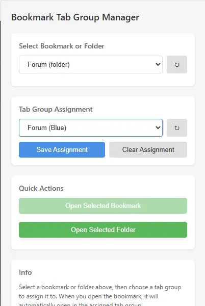

# Bookmark Tab Group Manager for Brave Browser

A Brave Browser extension that allows you to assign bookmarks and bookmark folders to specific tab groups. When you open a bookmark, it will automatically open in its assigned tab group.

## Disclaimer

> [!WARNING]  
> This extension was generated with the [Cursor](https://cursor.com/) AI IDE.
> I have no knowledge about browser extension development and simply wanted/needed this feature.
> Do not expect any support for this project.

## YouTube Demo - Click Me

[](https://youtu.be/Kvi67eTfrRk)

## Features

- **Assign Tab Groups to Bookmarks**: Edit any bookmark or bookmark folder to assign it to a specific tab group
- **Automatic Tab Group Assignment**: When you open a bookmark, it automatically opens in its assigned tab group
- **Folder Support**: Assign entire bookmark folders to tab groups - all bookmarks in the folder will open in the assigned group
- **Easy Management**: Use the extension popup to manage all your bookmark-to-tab-group assignments
- **Context Menu Integration**: Right-click on any bookmark in the bookmark bar to quickly edit its tab group assignment

## Installation

### From Source

1. Clone or download this repository
2. Open Brave Browser
3. Navigate to `brave://extensions/`
4. Enable "Developer mode" (toggle in the top right)
5. Click "Load unpacked"
6. Select the folder containing this extension

## Usage

### Assigning a Tab Group to a Bookmark

1. Click the extension icon in the toolbar to open the popup
2. Select a bookmark or folder from the dropdown
3. Choose a tab group from the "Tab Group Assignment" dropdown
4. Click "Save Assignment"

### Opening Bookmarks

- **Through Extension**: Select a bookmark in the popup and click "Open Selected Bookmark" or "Open Selected Folder"
- **Through Bookmark Bar**: Click any bookmark normally - if it has a tab group assignment, it will automatically open in that group
- **Note**: Automatic assignment when clicking bookmarks from the bookmark bar works best when the tab group already exists

### Clearing Assignments

1. Select the bookmark in the popup
2. Click "Clear Assignment" or select "-- No tab group (default) --" and save

## How It Works

- The extension stores bookmark-to-tab-group mappings in local storage
- When you open a bookmark, the extension checks if it has an assigned tab group
- If assigned, the bookmark opens in that tab group; otherwise, it opens normally
- Tab groups are identified by their ID, so if you delete and recreate a group, you'll need to reassign bookmarks

## Permissions

This extension requires the following permissions:

- **bookmarks**: To read and manage your bookmarks
- **tabs**: To create tabs and manage tab groups
- **tabGroups**: To access and manage tab groups
- **storage**: To save bookmark-to-tab-group assignments

## Development

### Project Structure

```
brave-bookmark-tabgroup/
├── manifest.json       # Extension manifest
├── background.js       # Service worker for background tasks
├── popup.html         # Extension popup UI
├── popup.css          # Popup styles
├── popup.js           # Popup functionality
├── icons/             # Extension icons (create these)
└── README.md          # This file
```

### Creating Icons

You'll need to create icon files in the `icons/` directory:
- `icon16.png` (16x16 pixels)
- `icon48.png` (48x48 pixels)
- `icon128.png` (128x128 pixels)

**Easy Method**: Open `create-icons.html` in your browser and click "Generate All Icons" - it will automatically create and download all required icon files.

Alternatively, you can use any image editor or online icon generator to create these.

## Limitations

- Tab groups must exist before bookmarks can be assigned to them
- If a tab group is deleted, bookmarks assigned to it will need to be reassigned
- Automatic assignment from bookmark bar clicks may not work perfectly in all scenarios (use the extension popup for guaranteed behavior)

## Troubleshooting

- **Bookmarks not opening in assigned groups**: Make sure the tab group is still assigned. Try refreshing the tab groups list in the popup.
- **Context menu not appearing**: Make sure the extension is enabled and reload it if necessary.
- **Popup not opening**: Check that the extension is enabled in `brave://extensions/`

### Debugging bookmark-bar / redirect issues

If a bookmark (e.g. one that redirects) opens **outside** the assigned tab group when clicked from the bookmark bar, but works when using the extension’s “Open Selected Folder”:

1. Open `background.js` and set `DEBUG = true` at the top.
2. Reload the extension (`brave://extensions/` → your extension → reload).
3. Open **Inspect views: service worker** (link under the extension) to open the DevTools console.
4. Reproduce: click the problematic bookmark from the bookmark bar.
5. Watch the `[BTG]` logs. They show:
   - `onCreated` / `onUpdated`: when we see the tab and capture its URL
   - `captureInitialUrl`: whether we stored or skipped the URL (and why)
   - `assignTabToBookmarkGroup`: lookup URL, bookmark search result, assignment, and any errors

Share the relevant `[BTG]` log lines (or a screenshot of the console) so we can see where it fails. When done, set `DEBUG = false` and reload.

## License

This project is open source and available for modification and distribution.

## Contributing

Contributions are welcome! Please feel free to submit issues or pull requests.
